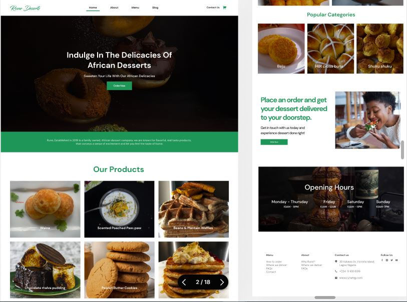

# Rune Desserts - Food Delivery Website



Welcome to the Rune Desserts project! This is a web application built using React Vite, React Hooks, and Sass, designed to facilitate food delivery and online shopping for delicious desserts.

## Table of Contents

- [Features](#features)
- [Installation](#installation)
- [Technologies Used](#technologies-used)
- [Folder Structure](#folder-structure)
- [Links](#links)
- [Author](#author)
- [Contributing](#contributing)
- [License](#license)

## Features

- **Browse and Order:** Explore a wide variety of mouthwatering desserts available for delivery or purchase.
- **Search Functionality:** Easily search for specific desserts using the search bar.
- **Shopping Cart:** Add desserts to your shopping cart for a seamless shopping experience.
- **Order Tracking:** Track the status of your food delivery or shopping order.
- **Responsive Design:** Enjoy a consistent and user-friendly experience on different devices.

## Installation

1. **Clone the Repository:** Start by cloning this repository to your local machine using the following command:
   ```
   git clone https://github.com/kizitech/Rune-Desserts.git
   ```

2. **Navigate to the Project Directory:** Use the `cd` command to move into the project directory:
   ```
   cd Rune-Desserts
   ```

3. **Install Dependencies:** Install the necessary dependencies using your preferred package manager. If you're using npm:
   ```
   npm install
   ```

4. **Run the Application:** Once dependencies are installed and environment variables are set, you can start the application using the following command:
   ```
   npm run dev
   ```

5. **Access the Application:** Open your web browser and navigate to `http://localhost:3000` to access the Rune Desserts website.

## Technologies Used

- **React Vite:** A fast build tool that significantly improves React development workflow.
- **React Hooks:** Allows you to use state and other React features without writing a class.
- **Sass:** A popular CSS preprocessor that makes styling more efficient and maintainable.

## Folder Structure

```
rune-desserts/
├── public/
│   ├── index.html
│   ├── ...
│
├── src/
│   ├── components/
│   │   ├── NavBar.jsx
│   │   ├── Footer.jsx
│   │   ├── DataProvider.jsx
│   │   ├── ...
│   │
│   ├── pages/
│   │   ├── Home.jsx
│   │   ├── Menu.jsx
│   │   ├── Cart.jsx
│   │   ├── ...
│   │
│   ├── sass/
│   │   ├── homeStyles/
│   │   ├── menuStyles/
│   │   ├── cartStyles/
│   │   ├── ...
│   │
│   ├── App.jsx
│   ├── main.jsx
│   ├── ...
│
├── README.md
├── ...
```

## Links

- Website: [https://runedesserts.netlify.app/](https://runedesserts.netlify.app/)
- GitHub Repository: [https://github.com/kizitech/Rune-Desserts](https://github.com/kizitech/Rune-Desserts)

## Author

- LinkedIn - [Ohani Kizito](https://www.linkedin.com/in/ohanikizito/)
- Twitter - [Ohani_Kizito](https://www.twitter.com/Ohani_Kizito)

## Contributing

We welcome contributions to improve the Rune Desserts project! If you find any bugs, have suggestions, or want to add new features, feel free to open an issue or submit a pull request. Please make sure to follow our [Contributing Guidelines](CONTRIBUTING.md).

## License

This project is licensed under the [MIT License](LICENSE).

---

Thank you for choosing Rune Desserts for your food delivery and shopping needs! We hope you enjoy the sweet treats and the user-friendly experience our application provides. Happy shopping! 🍰🛒